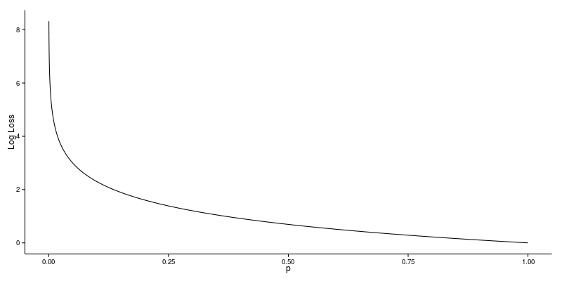
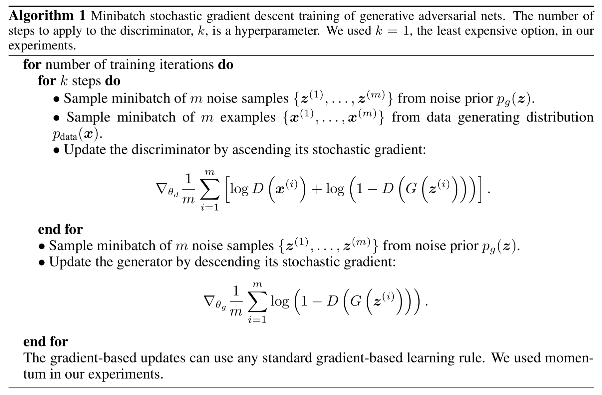

# Generative Adversarial Networks (GANs)

### What is GANs?
GANs belong to a set of algorithms named generative models. These algorithms belong to the field of unsupervised learning, a sub-set of ML which aims to study algorithms that learn the underlying structure of the given data, without specifying a target value. Generative models learn the intrinsic distribution function of the input data p(x) (or p(x,y) if there are multiple targets/classes in the dataset), allowing them to generate both synthetic inputs x’ and outputs/targets y’, typically given some hidden parameters.

### GAN architecture

The architecture comprises of 2 models
 - The first model is called a Generator and it aims to generate new data similar to the expected one. The Generator could be asimilated to a human art forger, which creates fake works of art.
 - The second model is named the Discriminator. This model’s goal is to recognize if an input data is ‘real’ — belongs to the original dataset — or if it is ‘fake’ — generated by a forger. In this scenario, a Discriminator is analogous to an art expert, which tries to detect artworks as truthful or fraud.

### Mathematically modelling a GAN

A neural network G(z, θ₁) is used to model the Generator mentioned above. It’s role is mapping input noise variables z to the desired data space x (say images).
Conversely, a second neural network D(x, θ₂) models the discriminator and outputs the probability that the data came from the real dataset, in the range (0,1). 

Note :  θᵢ represents the weight or parameters that define a neural network.

As a result, the Discriminator is trained to correctly classify the input data as either real or fake. This means it’s weights are updated as to maximize the probability that any real data input x is classified as belonging to the real dataset, while minimizing the probability that any fake image is classified as belonging to the real dataset. In more technical terms, the loss/error function used maximizes the function D(x), and it also minimizes D(G(z)).
Furthermore, the Generator is trained to fool the Discriminator by generating data as realistic as possible, which means that the Generator’s weight’s are optimized to maximize the probability that any fake image is classified as belonging to the real dataset. Formally this means that the loss/error function used for this network maximizes D(G(z)).

Note : the logarithm of probabilty is used instead of loss function since using the loss heavily penalises classifiers about an incorrect classification.

### Training a GAN

### Reference
- [Original Paper.](https://arxiv.org/abs/1406.2661)
- [GANs from scratch.](https://medium.com/ai-society/gans-from-scratch-1-a-deep-introduction-with-code-in-pytorch-and-tensorflow-cb03cdcdba0f)

