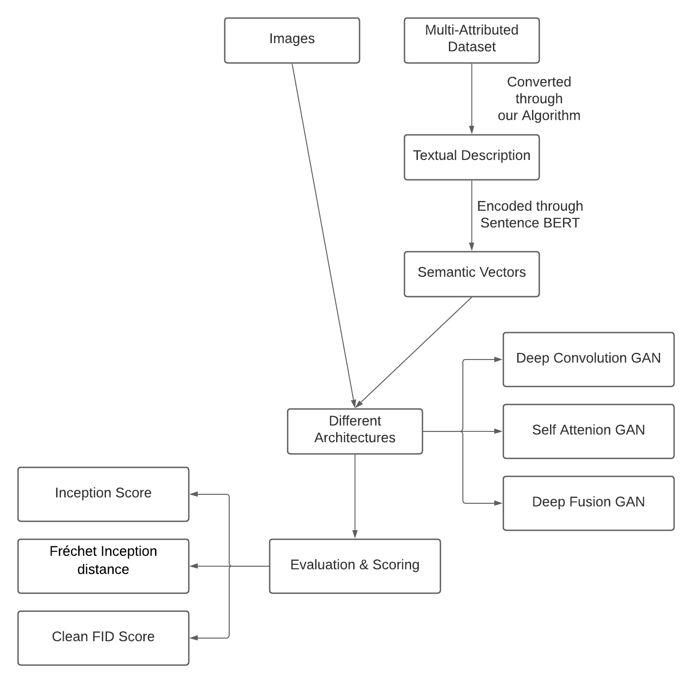
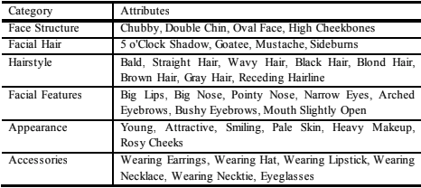
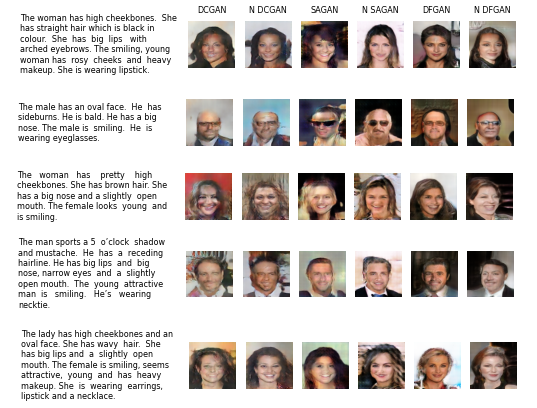
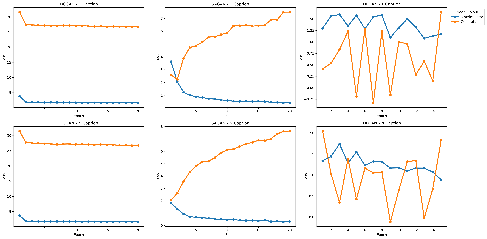

# Face Generation from Textual Description using Generative Adverserial Networks 📝  2️⃣ 👧👱 
  

---

## Table of Contents

🔹 [Abstract](#abstract)

🔹 [Process Flow](#process-flow)

🔹 [Description Categories](#description-categories)

🔹 [Notebooks](#progress-ladder)

🔹 [Results](#results)

🔹 [Future Scope](#future-scope)

🔹 [Research Paper and Citation](#research-paper-and-citation)

🔹 [Acknowledgement](#acknowledgement)

---

## Abstract  

Majority of current text-to-image generation tasks are limited to creating images like flowers (Oxford 102 Flower), birds (CUB-200-2011), and Common Objects (COCO) from captions. The existing face datasets such as Labeled Faces in the Wild and MegaFace lack description while datasets like CelebA have attributes associated but do not provide feature descriptions. Thus, in this paper we build upon an existing algorithm to create captions with the attributes provided in the CelebA dataset, which can not only generate one caption but it can also be extended to generate N captions per image. We utilise Sentence BERT to encode these descriptions into sentence embeddings. We then perform a comparative study of three models - DCGAN, SAGAN and DFGAN, by using these sentence embeddings along with a latent noise as the inputs to the different architectures. Finally, we calculate the Inception Scores and the FID values to compare the output images across different architectures.

---

## Process Flow

---

## Description Categories

---

## Notebooks

### MNIST
| Model        | Colab Link     |
| ------------- |-------------|
| [Vanilla GAN](MNIST-GANs/GAN)      |  |
| [DCGAN](MNIST-GANs/DCGAN)     |       |
| [CGAN](MNIST-GANs/CGAN) |       |
| [ACGAN](MNIST-GANs/ACGAN) |       |

### Face
| Model        | Single Caption     | N Caption     |
| ------------- |-------------|-------------|
| [DCGAN](Face-GANs/DCGAN)      |  |  |
| [SAGAN](Face-GANs/SAGAN)     |       |       |
| [DFGAN](Face-GANs/DFGAN) |       |       |

---

## Results
### Generated Faces

### Scores from the Different Models

### Loss vs Epoch

---

## Future Scope
We believe that this work can be further improved by:

1. Introducing a better dataset balancing strategy that considers very short and extremely long descriptions.
2. Increasing the training steps for these models.
3. Extending the resolution of images to 256x256, 512x512 or further.
4. Using a transformer based model like DALL-E.

---

## Research Paper and Citation

* You can find our research paper [here.](assets/FGTD.pdf)
* Paper has successfully been presented at the [5th International Conference on Inventive Communication and Computational Technologies.](http://icicct.org/2021/index.html)
* BibTex entry coming soon!

---

## Acknowledgement
We would like to thank our mentor Prof. Kalpana Deorukhkar for her constant support and guidance throughout the project.

